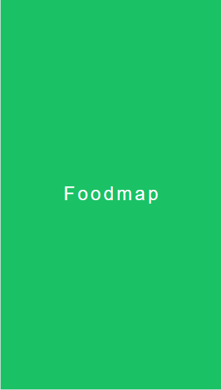

## Foodmap webApp

Foodmap es una webApp, Brindado a usuarios que solicitan servicio de todo tipo de comidas a restaurantes que esten aledaños, por medio del map que les permite ver la ubicacion exacta y precios e tipos de comidas que ofrecen.

Por la cual se nos pidio desarrollar como parte de nuestro retos de codigo en Laboratoria y parte del reto consiste en  dar  la interaccion entre web e usuario. 

 #### HERRAMIENTAS UTILIZADAS 

* HTML :
  >Parte del maquetado  

* CSS :
  >Estilos: colores/tamaños 

* JQUERY/JAVASCRIPT VANILLA : 
  > Parte de la funcionalidad 

  
#### Vistas de la aplicacion

> vista splash

> Vista principal

